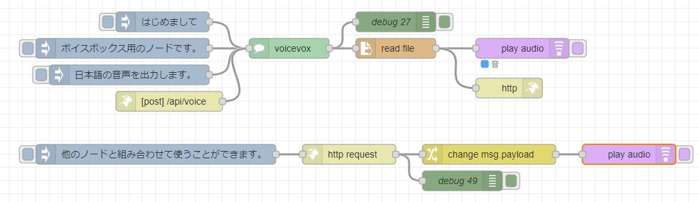
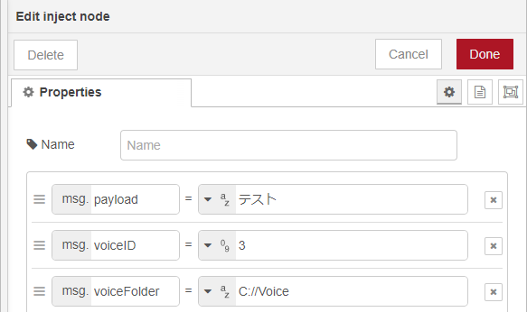

# node-red-contrib-voicevox-core

[voicevox_core](https://github.com/VOICEVOX/voicevox_core)を利用したNode-REDのノードです。  
文字列を受け取り、音声ファイルを出力します。  

▼voicevox_coreはこちら  
<https://github.com/VOICEVOX/voicevox_core>  

▼VOICEVOXはこちら  
<https://voicevox.hiroshiba.jp/>  

> [!CAUTION]
> **現状ではWindowsにしか対応していません。**  
> また**Pythonの環境が必要**で、仮想環境にパッケージがインストールされます。  

## 動作確認環境

- Windows 10
- Python 3.8.3
- Node.js v20.10.0
- npm 9.1.3

voicevox_coreは0.15.3がインストールされます。  

### サンプルフロー

[examples](./examples/)フォルダに入っています。  
  

音声ファイルを保存するフォルダを指定する必要があります。  
話者のIDはプルダウンで選択できます。  
  

msg.voiceID、msg.voiceFolderに値を入れて、ノードに渡すこともできます。  
この場合、msgの値が優先されます。  


## Node-RED関連

### ファイル構成

- .js: ノードの機能
- .html: エディタでの表示
- package.json: インストール時に使用、ノードのパスを指定

.jsの中のchild_processで、Pythonのプログラムを実行しています。  

### ローカルでの実行

ダウンローダのURLやバージョンを変更したいときは、このリポジトリをダウンロードしてください。  
Node-REDのノードとして追加できます。  

▼インストールする場合  
```npm install ＜フォルダのパス＞```  
▼アンインストールする場合  
```npm uninstall ＜パッケージ名＞```  

## Python関連

Pythonで実行するための環境構築を行うことができます。  
pyenvフォルダがPythonの仮想環境になっています。activate後、voicevox関連のファイルを実行できます。  

- setup.py: 環境構築
- downloader.py: ダウンローダの実行
- voicevox.py: 音声ファイルを出力（第一引数：文字列、第二引数：話者のID、第三引数：音声ファイルの保存先）
- id_list.py: 話者のリストを表示

リポジトリをダウンロード後、このディレクトリで```npm install```を実行すると、setup.pyが実行されます。  

## 検討事項

- Pythonプログラム実行中の表示
  - 音声ファイルを出力するのに少し時間がかかります。
  - 出力中にノードのステータスを表示して、分かりやすくしようと思っています。
- 何を出力するか
  - read fileノードで音声ファイルを開いてバイナリバッファで送ることもできますが、このノードでバイナリバッファを送るほうが使いやすいかも？
  - バイナリバッファで送るとファイルに保存しなくてもよくなりますが、出力に時間がかかります。
  - 選択できるようにしようかなと思っています。

## その他情報

▼Node-RED User Group Japan 「ノードの開発」  
<https://nodered.jp/docs/creating-nodes/>  
▼PythonでVOICEVOX COREを使ってみる（音声合成）  
<https://404background.com/program/voicevox-core/>  
▼Node-REDとVOICEVOX COREで音声合成（Python）  
<https://404background.com/program/node-red-voicevox/>  
▼python-venvノードと同じ仕組みで、インストール時にPythonの仮想環境を構築するようにしました。  
<https://404background.com/program/node-create-python-venv/>  
