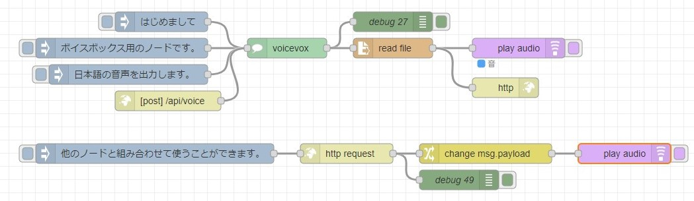
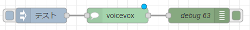
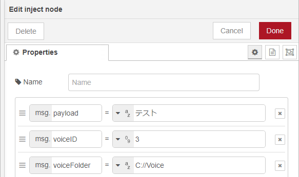
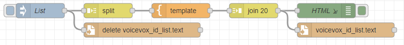
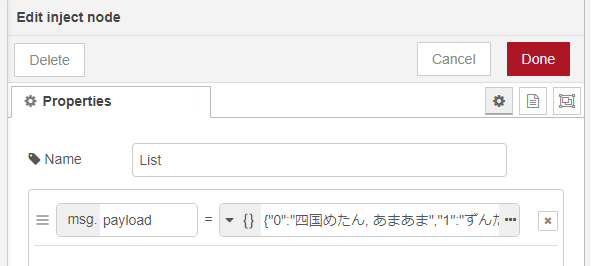

# examples

## sample-flow.json

このノードのサンプルフローです。

http in/outノード、play audioノードなどと一緒に使えます。

## multiple-test.json

複数のノードを配置した場合のフローです。

## msg-test.json

msgのプロパティで値を渡す場合のフローです。

msg.voiceID、msg.voiceFolderで値を渡すことができます。

## id-list.json

voicevox.htmlに記述されている、話者のIDのリストを出力するフローです。

id_list.pyを実行したときに、id_list.jsonも生成されます。そのJSONファイルの中身を、injectノードのmsg.payloadに貼り付けてください。

出力したファイルはNode-REDを起動しているディレクトリのvoicevox_id_list.textに保存されます。
